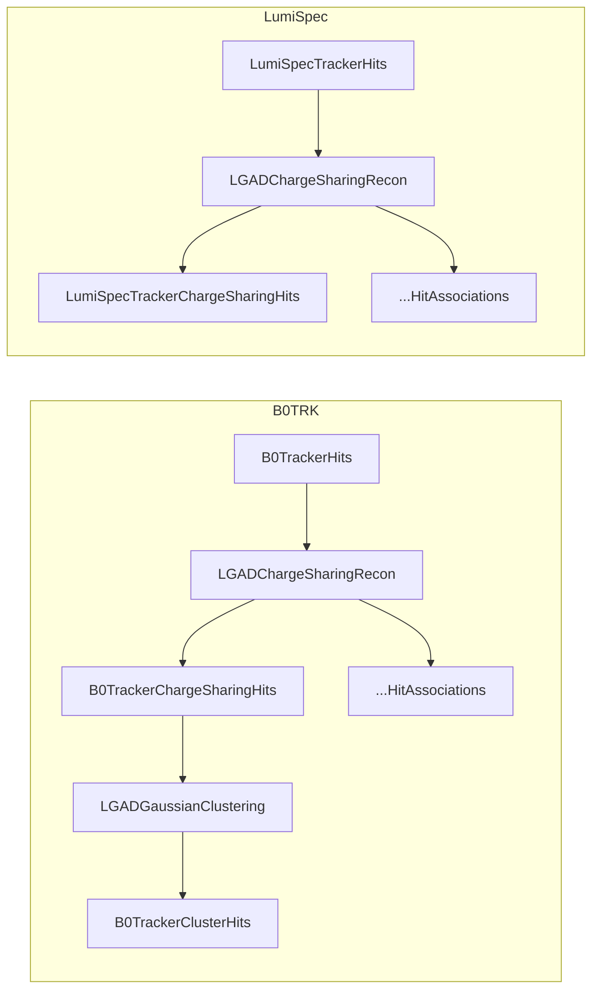

# AC-LGAD Charge Sharing EICrecon Plugin

Out-of-tree `EICrecon_MY` plugin that provides AC-LGAD charge-sharing reconstruction for the B0 tracker and Luminosity Spectrometer. Reads `edm4hep::SimTrackerHit` collections, applies a physics-motivated AC-LGAD charge-sharing model (LogA / LinA), reconstructs sub-pixel positions by Gaussian fitting, and emits `edm4eic::TrackerHit` and `edm4eic::Measurement2D` collections.

This plugin is structured to follow the upstream `eic/EICrecon` conventions (`algorithms::Algorithm`, `JOmniFactory`, `plugin_*` CMake helpers, per-detector plugin libraries). The novel physics lives in the header-only library under `../core/` and is shared with the standalone Geant4 validation harness.

## Naming

| Legacy symbol | New name |
|---------------|----------|
| `ChargeSharingReconstructor` | `LGADChargeSharingRecon` |
| `ChargeSharingReconFactory` | `LGADChargeSharingRecon_factory` |
| `ChargeSharingConfig` | `LGADChargeSharingReconConfig` |
| `ChargeSharingClustering` | `LGADGaussianClustering` |
| `ChargeSharingClustering_factory` | `LGADGaussianClustering_factory` |
| `ChargeSharingClusteringConfig` | `LGADGaussianClusteringConfig` |
| `ChargeSharingMonitor` | `LGADChargeSharingMonitor` |

- Plugin-visible symbols: `eicrecon::` namespace.
- Novel physics: `chargesharing::{core,fit}::` namespaces inside `core/include/chargesharing/{core,fit}/*.hh` (compiled static library `chargesharing::core`; shared with standalone harness).
- All plugin-side headers use `.h`; the compiled `chargesharing_core` library keeps `.hh` for its public headers.

## Per-detector plugins and collections

| Plugin library | Input collection | Output collections |
|----------------|------------------|--------------------|
| `B0TRK_lgad_chargesharing.so` | `B0TrackerHits` | `B0TrackerChargeSharingHits`, `B0TrackerChargeSharingHitAssociations`, `B0TrackerClusterHits` |
| `LumiSpec_lgad_chargesharing.so` | `LumiSpecTrackerHits` | `LumiSpecTrackerChargeSharingHits`, `LumiSpecTrackerChargeSharingHitAssociations` |
| `LGAD_chargesharing_benchmark.so` | (reads the above) | histograms + TTree in `-Phistsfile=...` |

LumiSpec does not currently get clustering; add a `LGADGaussianClustering_factory` registration in `src/detectors/LumiSpec/` when segmentation is ready.

## Build

```bash
./eic-shell
cmake -S eicrecon -B build/eicrecon \
      -DCMAKE_INSTALL_PREFIX=$(pwd)/eicrecon/install
cmake --build build/eicrecon --target install
```

Plugins are installed to `eicrecon/install/plugins/`.

## Run

```bash
export EICrecon_MY=$(pwd)/eicrecon/install
eicrecon \
    -Pplugins=B0TRK_lgad_chargesharing,LumiSpec_lgad_chargesharing,LGAD_chargesharing_benchmark \
    -Phistsfile=lgad_hists.root \
    -Ppodio:output_file=reco_output.edm4hep.root \
    sim_output.edm4hep.root
```

## Core configuration

The user-facing config has been trimmed to what is not derivable from DD4hep. Everything else (pixel pitch, pad size, grid offset, detector size/thickness, cell counts) is fetched from the `CartesianGridXY` / `CartesianGridXZ` segmentation in `init()`.

### `LGADChargeSharingRecon`

| Parameter | Type | Default | Description |
|-----------|------|---------|-------------|
| `signalModel` | int | 0 (LogA) | 0 = LogA, 1 = LinA |
| `activePixelMode` | int | 0 | 0=Neighborhood, 1=RowCol, 2=RowCol3x3, 3=ChargeBlock2x2, 4=ChargeBlock3x3 |
| `reconMethod` | int | 2 | 0=Centroid, 1=Gaussian1D, 2=Gaussian2D |
| `readout` | string | - | DD4hep readout name |
| `minEDepGeV` | float | 0 | Energy threshold |
| `neighborhoodRadius` | int | 2 | Half-width (2 = 5x5 grid) |
| `d0Micron` | double | 1.0 | LogA d0 |
| `linearBetaPerMicron` | double | 0 | LinA beta (0 = auto from pitch) |
| `ionizationEnergyEV` | double | 3.6 | e/h pair energy |
| `amplificationFactor` | double | 20 | AC-LGAD gain |
| `noiseEnabled` | bool | true | Noise injection |
| `noiseElectronCount` | double | 500 | Electronic noise RMS |

### `LGADGaussianClustering`

| Parameter | Type | Default | Description |
|-----------|------|---------|-------------|
| `readout` | string | - | DD4hep readout name |
| `deltaT` | double | 1.0 ns | Time gate for union-find merge |
| `reconMethod` | int | 2 | 0=Centroid, 1=Gaussian1D, 2=Gaussian2D |
| `fitErrorPercent` | double | 5.0 | Fit uncertainty as % of max charge |

## Pipeline



## Algorithm

For each `SimTrackerHit`, `LGADChargeSharingRecon`:

1. Decodes the cell ID through the DD4hep segmentation decoder to locate the center pad.
2. Computes per-pad charge fractions across a `(2*neighborhoodRadius+1)^2` neighborhood using the configured physics model (LogA logarithmic attenuation or LinA linear attenuation). See [Tornago et al.](https://doi.org/10.1016/j.nima.2021.165319).
3. Optionally applies per-pixel gain variation and electronic noise.
4. Reconstructs the sub-pad hit position (charge-weighted centroid, 1D Gaussian on row+column, or full 2D Gaussian).
5. Emits a `TrackerHit` with the reconstructed position in global coordinates plus a diagonal position-error covariance, and an `MCRecoTrackerHitAssociation` linking back to the truth `SimTrackerHit`.

`LGADGaussianClustering` then runs union-find over DD4hep neighbours within `deltaT` and emits `Measurement2D` per cluster, with cluster position extracted by the same Gaussian fit used by the reconstructor.

## Benchmark output

Loading the `LGAD_chargesharing_benchmark` plugin produces validation histograms in the shared `-Phistsfile=...` TFile, under the `LGADChargeSharing/` directory:

| Histogram | Description |
|-----------|-------------|
| `hResidualX` / `hResidualY` / `hResidualR` | Position residuals (reco - truth) |
| `hRecoVsTrueX` / `hRecoVsTrueY` | Reco vs truth correlation |
| `hTrueXY` / `hRecoXY` | 2D scatter plots |
| `hResidualVsTrueX` / `hResidualVsTrueY` | Residual vs position (bias) |
| `hEnergyDeposit` | Energy deposit distribution |

A TTree named `hits` is also produced with per-hit `trueX/Y/Z`, `reconX/Y/Z`, `residualX/Y/R`, `edep`, `time`, `cellID`, `eventNumber`, `detectorIndex` branches.

## Relationship to the standalone Geant4 harness

`../epicChargeSharing.cc`, `../include/`, `../src/` form a standalone Geant4 **validation harness**, not an ePIC simulator. ePIC production simulation uses `npsim`/`ddsim`. The standalone harness runs the exact same `core/` physics on parametric pad grids so that plugin behaviour can be cross-checked against a simplified environment.
